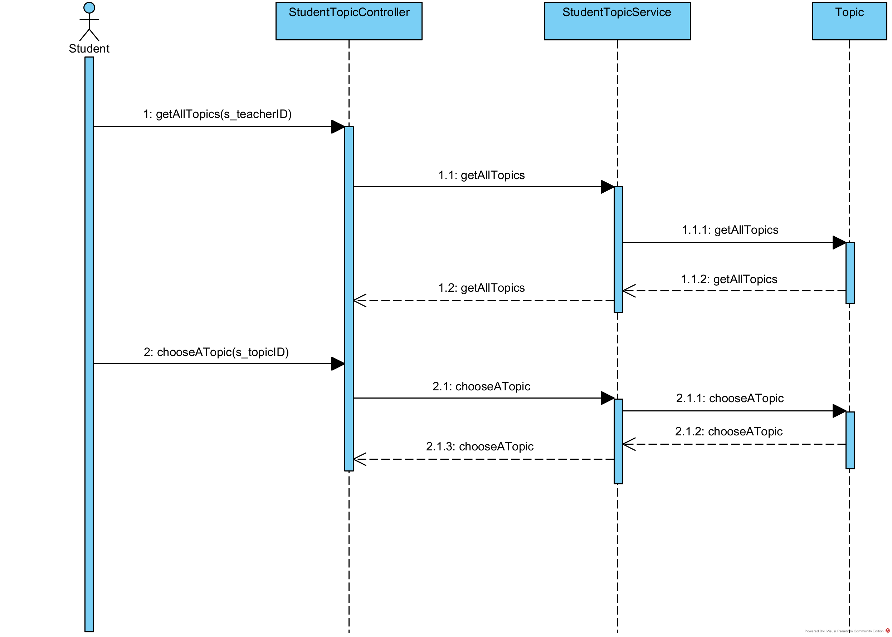
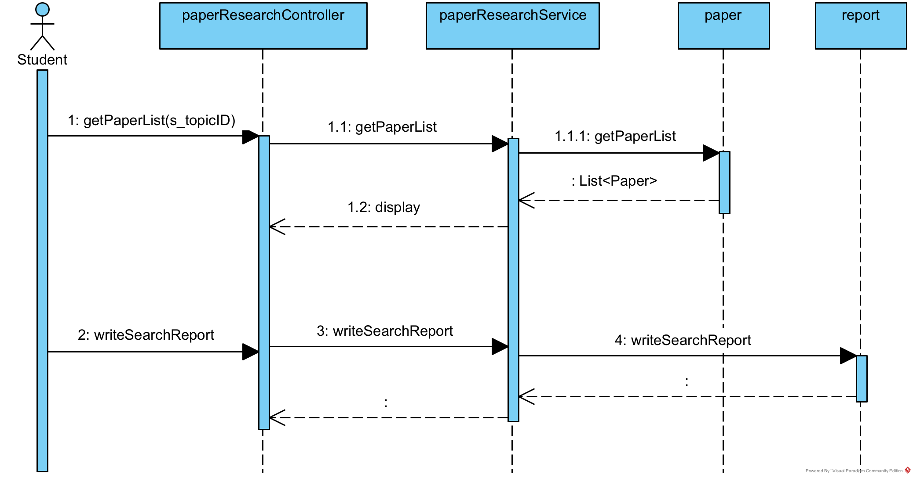
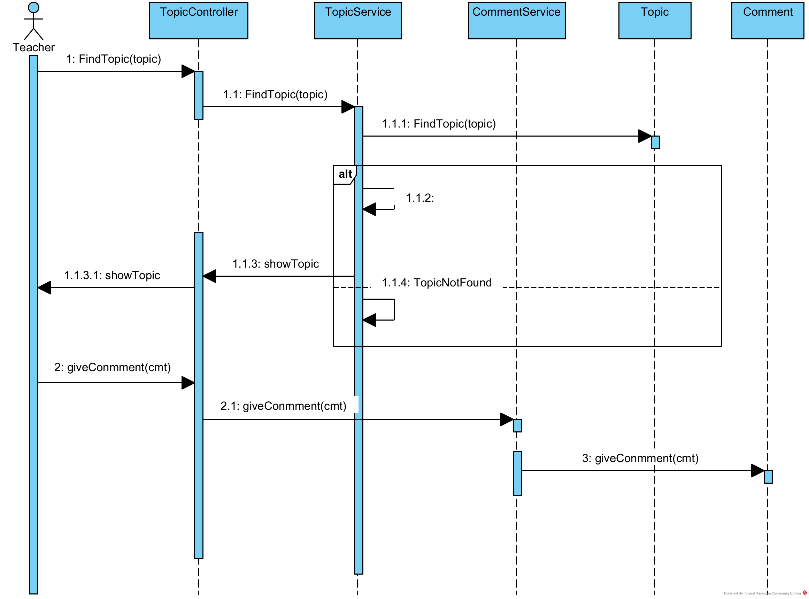
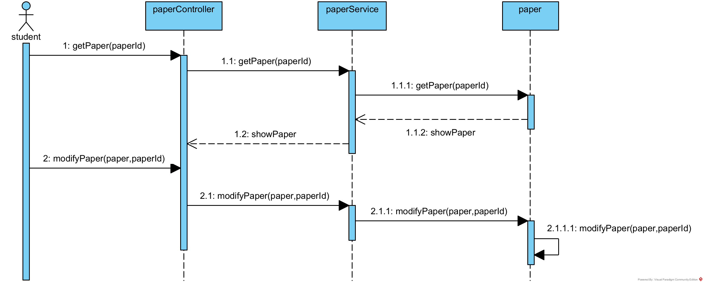
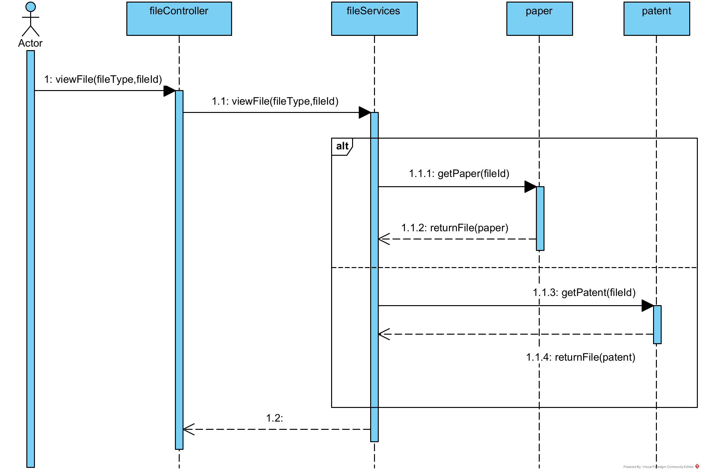
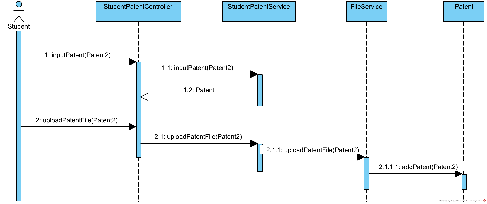
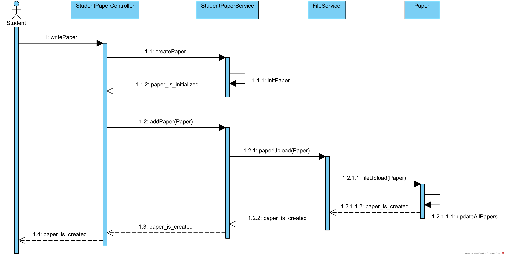
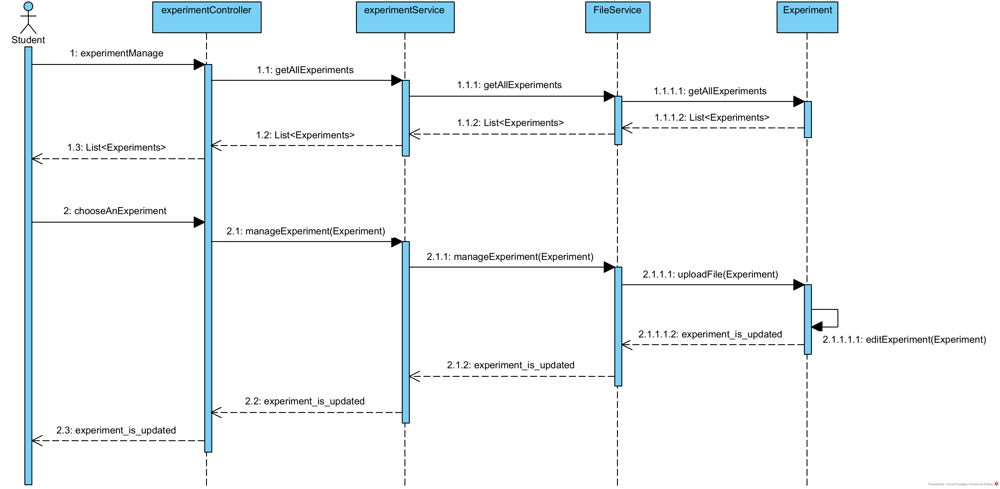
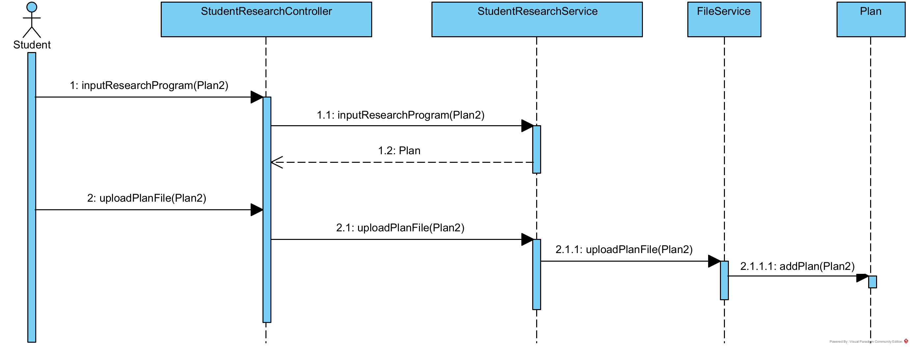
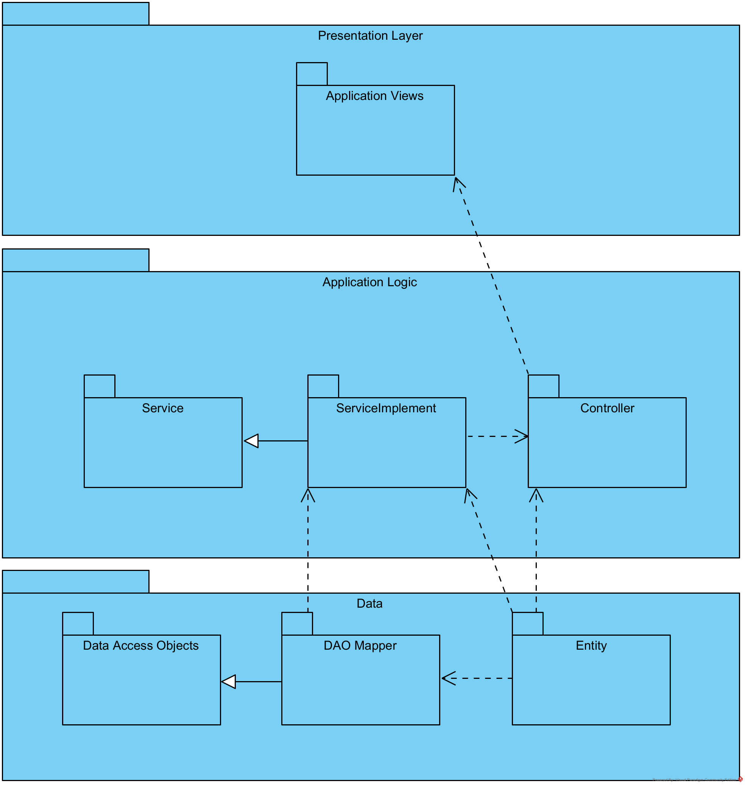

# 第三次大作业

## 类图

>### 1. (第一版)包括学生、老师、主题等类和相应的泛化、关联关系

>.png "类图(第一版)")

>### 2. (第二版)为File类增加Abstract Factory模式

>.png "类图(第二版)")

>### 3. 使用Abstract Factory设计模式的原因：
>>+ 分离了具体的类
>>+ 方便修改继承于File的各个子类
>>+ 有利于各子类的一致性

## 时序图

>### 1. 教师添加研究主题的用例的时序图

>

>### 2. 学生选择研究课题的用例的时序图

>

>### 3. 学生进行文献调研的用例的时序图

>

>### 4. 老师评价学生论文的用例的时序图

>

>### 5. 学生根据老师的评价修改论文的用例的时序图

>

>### 6. 老师查看学生上传文档的用例的时序图

>

>### 7. 学生撰写专利并上传的用例的时序图

>

>### 8. 学生撰写论文并上传的用例的时序图

>

>### 9. 学生填写实验信息并上传相应实验报告的用例的时序图

>

>### 10. 学生制定研究方案并上传相应文件的用例的时序图

>

## 包图

### 本项目的Architectural Pattern采用MVC设计模式
>### 原因：
>>1. 可以为一个模型在运行时同时建立和使用多个视图
>>2. 视图与控制器的可接插性
>>3. 模型的可移植性
>>4. 潜在的框架结构
>### 具体情况如下图所示:

>
