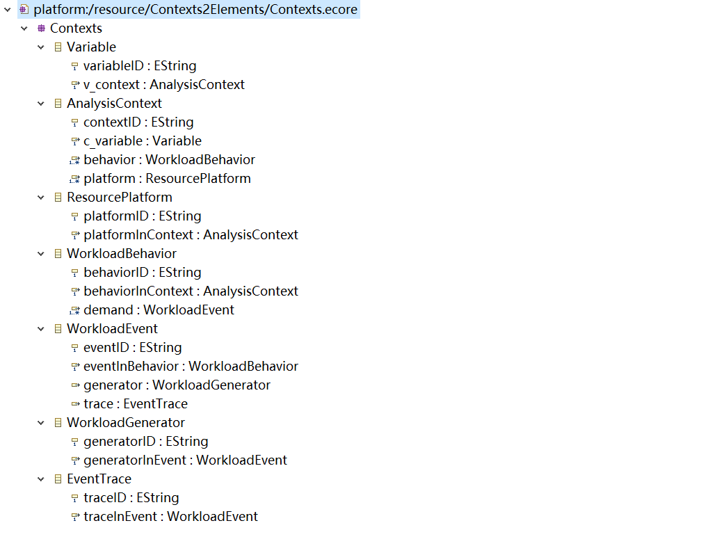
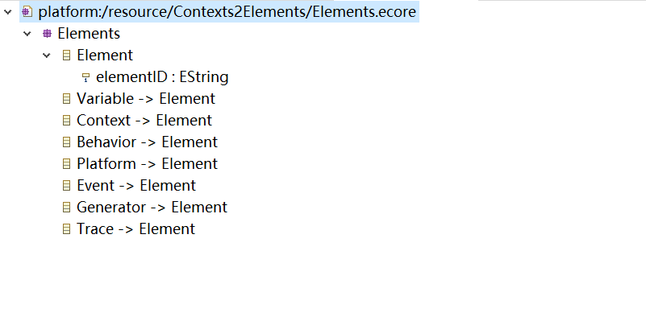
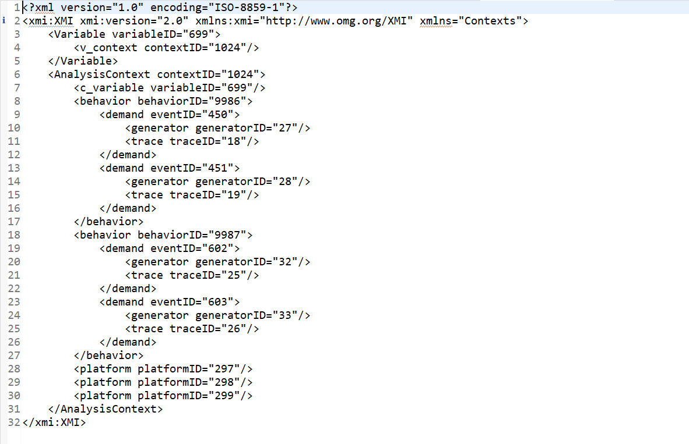
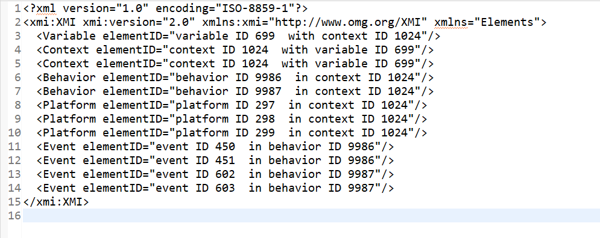

# 模型转换源码文件
模型转换源码文件为Contexts2Elements文件夹中的Contexts2Elements.atl文件。
# 输入\输出端模型.xmi文件
输入端模型文件为Contexts2Elements文件夹中的sample-Contexts.xmi文件，输出端模型文件为Contexts2Elements文件夹中的sample-Elements.xmi文件。
# 输入端元模型截图

# 输出端元模型截图

# 输入端模型截图

# 输出端模型截图
